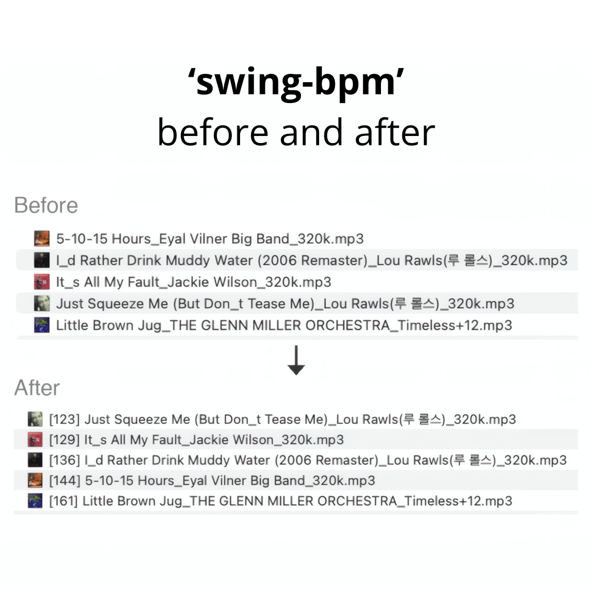
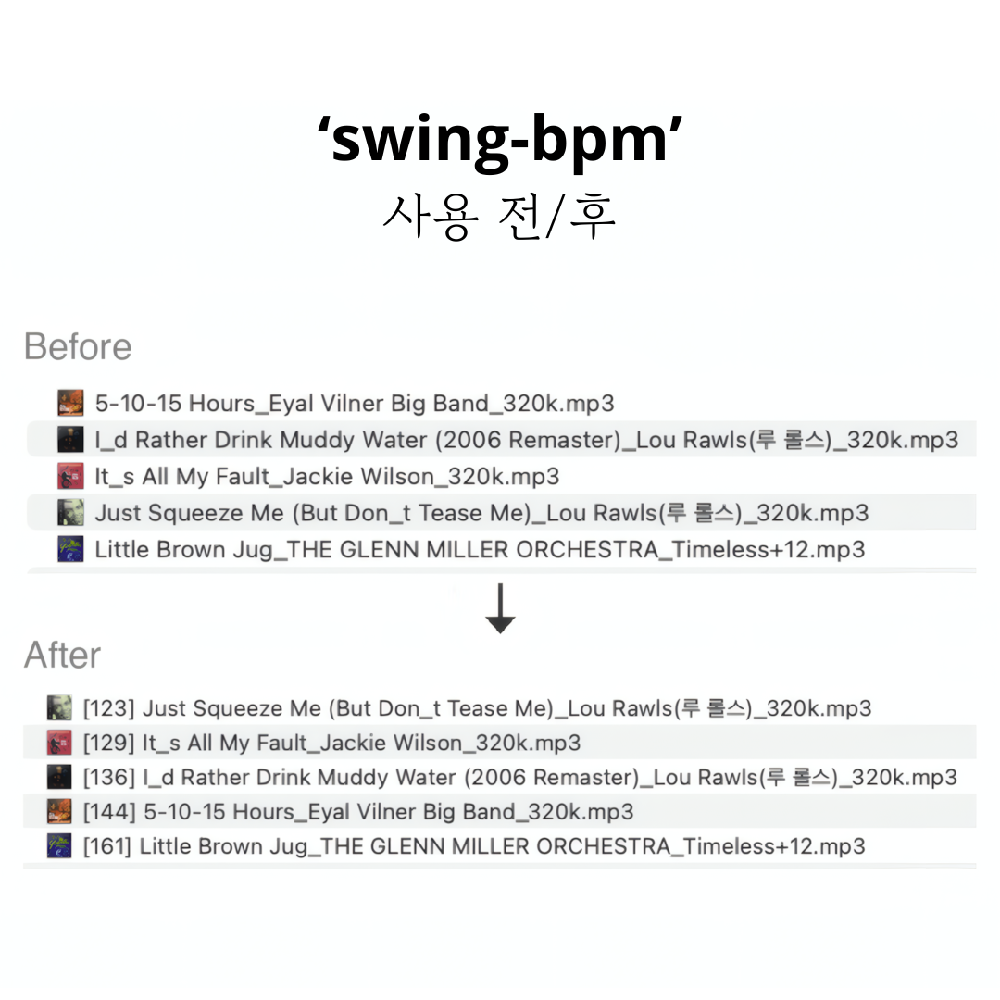

# swing-bpm

[](https://buymeacoffee.com/kunokim)

한글 설명은 맨 아래에 있습니다.

Automatic BPM detection optimized for **swing & jazz music**.

Standard BPM detectors often misidentify fast swing tempos (180+ BPM) as half-tempo. `swing-bpm` solves this with a hybrid detection algorithm that combines onset analysis with Predominant Local Pulse (PLP), achieving **100% accuracy** on an 80-song test set spanning 80–304 BPM.



## Install

```bash
pip install swing-bpm
```

To update:

```bash
pip install --upgrade swing-bpm
```

<details>
<summary><strong>Install from source (alternative)</strong></summary>

### macOS

1. Install Python 3.9+ (if not already installed):
   ```bash
   brew install python
   ```

2. Download and install swing-bpm:
   ```bash
   git clone https://github.com/Geono/swing-bpm.git
   cd swing-bpm
   pip3 install .
   ```

### Windows

1. Install Python 3.9+ from [python.org](https://www.python.org/downloads/). **Check "Add Python to PATH"** during installation.

2. Install [Git for Windows](https://git-scm.com/downloads/win) if you don't have it.

3. Open **Command Prompt** or **PowerShell**, then:
   ```
   git clone https://github.com/Geono/swing-bpm.git
   cd swing-bpm
   pip install .
   ```

   If you don't have Git, you can [download the ZIP](https://github.com/Geono/swing-bpm/archive/refs/heads/main.zip) instead, extract it, and run `pip install .` inside the folder.

### Update from source

```bash
cd swing-bpm
git pull
pip3 install .
```

If you installed with `pipx`:

```bash
cd swing-bpm
git pull
pipx install --force .
```

</details>

## Usage

Tag all music files in a folder:

```bash
# macOS
swing-bpm ~/Music/swing/

# Windows
swing-bpm "C:\Users\YourName\Music\swing"
```

This will recursively scan all subdirectories and for each file:
1. Detect BPM for each file
2. Rename files with a `[BPM]` prefix (e.g., `[174] Tea For Two.mp3`)
3. Write BPM to audio metadata (ID3 TBPM for MP3/WAV, Vorbis comment for FLAC)

### Options

```bash
swing-bpm ./music/ --dry-run       # Preview without changes
swing-bpm ./music/ --no-rename     # Metadata only, don't rename
swing-bpm ./music/ --no-metadata   # Rename only, don't write metadata
swing-bpm ./music/ --tag-title     # Prepend [BPM] to title metadata
swing-bpm ./music/ --overwrite     # Re-detect already tagged files
swing-bpm track1.mp3 track2.flac   # Process specific files
```

The `--tag-title` option prepends `[BPM]` to the title metadata tag (e.g., ID3 TIT2). This is useful for DJ software like Mixxx that displays the title from metadata — you can see the BPM directly in the title column. If a file has no title metadata, the filename is used as a fallback.

### Supported formats

- MP3
- FLAC
- WAV

## How it works

### The problem

Most BPM detectors work by finding repeated rhythmic patterns in audio. In swing jazz, beats 1 and 3 of each bar carry heavy accents from the rhythm section, while beats 2 and 4 are lighter. At fast tempos (180+ BPM), detectors often lock onto those strong accents on 1 and 3, which repeat at half the actual tempo — so a 200 BPM song gets detected as 100 BPM.

### The solution: a 4-stage hybrid approach

**Stage 1: Base detection**

We use `librosa.beat.beat_track()` to find an initial tempo estimate. This works well for slow-to-mid tempos but frequently returns half-tempo for fast songs.

**Stage 2: Onset ratio analysis**

**Onset** = a sudden burst of energy in the audio, like a drum hit, a horn accent, or a piano chord attack. We measure onset strength at each detected beat and compare it to the onset strength at the *midpoints* between beats.

If the true tempo is double what was detected, those midpoints are actually real beats — so they'll have strong onsets too. We calculate the ratio: `midpoint onset strength / on-beat onset strength`.

- **Ratio < 0.27** → midpoints are quiet, detected tempo is correct
- **Ratio > 0.33** → midpoints have strong hits, true tempo is 2x
- **Ratio 0.27–0.33** → ambiguous, need a tiebreaker

**Stage 3: PLP tiebreaker**

For borderline cases, we use **PLP (Predominant Local Pulse)** — an algorithm that tracks how the perceived "pulse" of the music evolves over time, frame by frame. Unlike beat tracking which commits to a single global tempo, PLP independently estimates the local pulse at each moment, then we take the median. This gives a second opinion that reliably resolves the ambiguous cases where onset ratio alone can't decide.

**Stage 4: PLP stability guard** *(new in v0.2.0)*

When the base tempo is slow (< 105 BPM), the onset ratio can be misleadingly high — walking bass, piano comping, and vocal phrasing fill the space between beats with continuous energy, even though no real beats exist at the midpoints. To prevent false doubling, we check the **PLP stability** (standard deviation of local pulse estimates). If PLP median is close to the doubled tempo and PLP is moderately stable (std ≤ 55), we trust the doubling. Otherwise, a high PLP std (> 40) means PLP cannot find a consistent fast pulse, confirming the song is genuinely slow — and the doubling is rejected.

## Test results

Tested on 80 swing/jazz tracks with human-verified BPM labels (80–304 BPM). All detected values fall within ±10 BPM of the true tempo.

Additionally validated against 417 human-labeled tracks (80–304 BPM): 99.3% within ±10 BPM, with an average absolute error of 3.2 BPM.

<details>
<summary><strong>Full test results (80 songs, 100% accuracy)</strong></summary>

| True BPM | Detected | Diff | Artist | Title |
|----------|----------|------|--------|-------|
| 80 | 81 | +1 | Eyal Vilner | Don't You Feel My Leg |
| 82 | 83 | +1 | Eyal Vilner | Tell Me Pretty Baby |
| 100 | 96 | -4 | Eyal Vilner | After The Lights Go Down Low |
| 107 | 108 | +1 | Helen Humes | Sneaking Around With You |
| 114 | 117 | +3 | Eyal Vilner | Will You Be My Quarantine? |
| 116 | 123 | +7 | Lou Rawls | Just Squeeze Me (But Don't Tease Me) |
| 118 | 117 | -1 | Brooks Prumo Orchestra | Blue Lester |
| 120 | 117 | -3 | Eyal Vilner | Call Me Tomorrow, I Come Next Week |
| 125 | 123 | -2 | Eyal Vilner | Just A Lucky So And So |
| 126 | 129 | +3 | Mint Julep Jazz Band | Exactly Like You |
| 127 | 123 | -4 | Frank Sinatra | You Make Me Feel So Young |
| 128 | 129 | +1 | Eyal Vilner | I Don't Want to be Kissed |
| 128 | 129 | +1 | The Griffin Brothers | Riffin' With Griffin' |
| 128 | 129 | +1 | Shirt Tail Stompers | Oh Me, Oh My, Oh Gosh |
| 130 | 136 | +6 | Lou Rawls | I'd Rather Drink Muddy Water |
| 133 | 123 | -10 | Louis Jordan | No Sale |
| 134 | 136 | +2 | The Treniers | Drink Wine, Spo-Dee-O-Dee |
| 134 | 136 | +2 | Fred Mollin, Blue Sea Band | Shoo Fly Pie And Apple Pan Dowdy |
| 134 | 136 | +2 | Naomi & Her Handsome Devils | Take It Easy Greasy |
| 135 | 136 | +1 | Indigo Swing | The Best You Can |
| 138 | 136 | -2 | Benny Goodman | What Can I Say After I Say I'm Sorry |
| 139 | 136 | -3 | Louis Jordan | Cole Slaw (Sorghum Switch) |
| 140 | 136 | -4 | Count Basie | Things Ain't What They Used To Be |
| 143 | 136 | -7 | George Williams | Celery Stalks At Midnight |
| 153 | 152 | -1 | Roy Eldridge | Jump Through the Window |
| 155 | 161 | +6 | Brooks Prumo Orchestra | Broadway |
| 155 | 161 | +6 | Illinois Jacquet | What's This |
| 156 | 161 | +5 | The Griffin Brothers | Shuffle Bug |
| 160 | 152 | -8 | Count Basie | Swingin' The Blues |
| 161 | 161 | +0 | Mercer Ellington | Steppin' Into Swing Society |
| 162 | 161 | -1 | Eyal Vilner | Blue Skies |
| 166 | 167 | +1 | Ella Fitzgerald | Mack The Knife (Live) |
| 167 | 161 | -6 | Count Basie | Fair And Warmer |
| 170 | 172 | +2 | Count Basie & His Orchestra | Sweets |
| 170 | 178 | +8 | Duke Ellington, Johnny Hodges | Villes Ville Is the Place, Man |
| 171 | 172 | +1 | Johnny Hodges | Something to Pat Your Foot To |
| 173 | 178 | +5 | Duke Ellington | Let's Get Together |
| 174 | 172 | -2 | Eyal Vilner | Bumpy Tour Bus |
| 174 | 172 | -2 | Eyal Vilner | Tea For Two |
| 176 | 178 | +2 | Eyal Vilner | T'aint What You Do |
| 180 | 185 | +5 | Eyal Vilner | I Want Coffee |
| 181 | 191 | +10 | Bud Freeman's Summa Cum Laude Orchestra | You Took Advantage Of Me |
| 182 | 178 | -4 | Eyal Vilner | I Love The Rhythm in a Riff |
| 182 | 178 | -4 | The Glenn Crytzer Orchestra | Jive at Five |
| 182 | 185 | +3 | Harry James And His Orchestra | Trumpet Blues and Cantabile |
| 182 | 191 | +9 | Bud Freeman's Summa Cum Laude Orchestra | You Took Advantage Of Me |
| 190 | 191 | +1 | Illinois Jacquet | Bottom's Up |
| 190 | 199 | +9 | Eyal Vilner | Chabichou |
| 190 | 191 | +1 | Tommy Dorsey | Well Git It |
| 192 | 199 | +7 | The Griffin Brothers | Blues With A Beat |
| 192 | 191 | -1 | Freddie Jackson | Duck Fever |
| 195 | 191 | -4 | Earl "Fatha" Hines | Hollywood Hop |
| 195 | 199 | +4 | The Griffin Brothers | Blues With A Beat |
| 195 | 199 | +4 | Count Basie | It's Sand, Man |
| 195 | 199 | +4 | Chick Webb | Lindyhopper's Delight |
| 196 | 191 | -5 | Naomi & Her Handsome Devils | I Know How To Do It |
| 203 | 199 | -4 | Ella Fitzgerald, Chick Webb | I Want To Be Happy |
| 205 | 199 | -6 | Jack McVea & His Orchestra | Ube Dubie |
| 205 | 199 | -6 | Jonathan Stout & His Campus Five | Wholly Cats |
| 207 | 215 | +8 | Brooks Prumo Orchestra | Dinah |
| 210 | 207 | -3 | — | Diga Diga Doo |
| 210 | 215 | +5 | Artie Shaw | Oh! Lady, Be Good |
| 210 | 207 | -3 | Harry James | Trumpet Blues And Cantabile |
| 212 | 207 | -5 | Count Basie & His Orchestra | Fantail |
| 215 | 215 | +0 | — | Riff Time |
| 216 | 215 | -1 | Benny Goodman | Jam Session 1936 |
| 220 | 225 | +5 | — | Jammin' the Blues |
| 222 | 225 | +3 | — | Clap Hands, Here Comes Charlie |
| 225 | 225 | +0 | — | Harlem Jump |
| 227 | 225 | -2 | — | Sing You Sinners |
| 228 | 235 | +7 | Earl Hines | The Earl |
| 230 | 225 | -5 | Eyal Vilner | Lobby Call Blues |
| 230 | 235 | +5 | Brooks Prumo Orchestra | Six Cats And A Prince |
| 240 | 235 | -5 | Eyal Vilner | Swing Brother Swing |
| 245 | 246 | +1 | Eyal Vilner | Jumpin' At The Woodside |
| 246 | 246 | +0 | Count Basie | Jumping At The Woodside |
| 250 | 258 | +8 | Brooks Prumo Orchestra | Peek-A-Boo |
| 250 | 258 | +8 | Eyal Vilner | Swingin' Uptown |
| 255 | 258 | +3 | King Of Swing Orchestra | Bugle Call Rag |
| 304 | 304 | +0 | Eyal Vilner | Hellzapoppin' |

</details>

## As a library

```python
from swing_bpm import detect_bpm

bpm = detect_bpm("Tea For Two.mp3")
print(bpm)  # 174
```

## Support

If this tool saved you time, consider buying me a coffee!

[](https://buymeacoffee.com/kunokim)

## Acknowledgments

Special thanks to [sabok](https://www.instagram.com/sabok_swing/) for providing sample music used in testing and development.

## Changelog

### v0.4.0

- **Recursive directory scanning by default** — When a directory is given, all subdirectories are now scanned automatically. No extra flags needed.

### v0.3.0

- **New: `--tag-title` option** — Prepends `[BPM]` to the title metadata tag (ID3 TIT2 for MP3/WAV, Vorbis comment for FLAC). Useful for DJ software that doesn't reliably read BPM metadata. Falls back to filename when the title tag is empty.

### v0.2.1

- **Fix: false half-tempo on mid-tempo songs with slow base detection** — When `beat_track` returned half-tempo (e.g., 74 instead of 148), Stage 4's PLP stability guard (std > 40) could block the correct doubling even when PLP median clearly confirmed the doubled tempo. Now, if PLP median is close to 2× base and PLP is moderately stable (std ≤ 55), doubling is applied before the stability guard. This fixes songs like "Mack the Knife" (74 → 148) without affecting genuinely slow songs.
- **Validated against 549 human-labeled tracks** — 0 regressions vs v0.2.0.

### v0.2.0

- **Fix: false double-tempo on slow ballads** — Songs under ~105 BPM (e.g., a 90 BPM ballad) could be incorrectly detected as double tempo (180 BPM) because walking bass and sustained harmonics inflated the onset ratio. Added a 4th detection stage that checks PLP stability before doubling: if PLP cannot find a consistent fast pulse (std > 40), the doubling is rejected.
- **Expanded validation** — Tested against 417 human-labeled tracks (up from 80). Accuracy: 99.3% within ±10 BPM, average error 3.2 BPM.
- **Internal: cached PLP computation** — PLP is now computed once and reused across detection stages, avoiding redundant FFT work.

### v0.1.0

- Initial release with 3-stage hybrid detection (beat_track + onset ratio + PLP tiebreaker).
- 100% accuracy on 80-song test set (80–304 BPM, all within ±10 BPM).

## License

MIT

---

# swing-bpm (한국어)

스윙 & 재즈 음악에 최적화된 **자동 BPM 측정 도구**입니다.

일반적인 BPM 측정기는 빠른 스윙 템포(180+ BPM)를 절반 속도로 잘못 인식하는 경우가 많습니다. `swing-bpm`은 onset 분석과 PLP(Predominant Local Pulse)를 결합한 하이브리드 알고리즘으로 이 문제를 해결하며, 80~304 BPM 범위의 80곡 테스트에서 **100% 정확도**를 달성했습니다.



## 설치

```bash
pip install swing-bpm
```

업데이트:

```bash
pip install --upgrade swing-bpm
```

<details>
<summary><strong>소스에서 설치 (대안)</strong></summary>

### macOS

1. Python 3.9 이상 설치 (이미 있다면 생략):
   ```bash
   brew install python
   ```

2. swing-bpm 다운로드 및 설치:
   ```bash
   git clone https://github.com/Geono/swing-bpm.git
   cd swing-bpm
   pip3 install .
   ```

### Windows

1. [python.org](https://www.python.org/downloads/)에서 Python 3.9 이상을 설치합니다. 설치 시 **"Add Python to PATH"를 반드시 체크**하세요.

2. Git이 없다면 [Git for Windows](https://git-scm.com/downloads/win)를 설치합니다.

3. **명령 프롬프트** 또는 **PowerShell**을 열고 아래를 입력합니다:
   ```
   git clone https://github.com/Geono/swing-bpm.git
   cd swing-bpm
   pip install .
   ```

   Git이 없다면 [ZIP 파일을 다운로드](https://github.com/Geono/swing-bpm/archive/refs/heads/main.zip)한 뒤 압축을 풀고, 해당 폴더에서 `pip install .`을 실행하면 됩니다.

### 소스에서 업데이트

```bash
cd swing-bpm
git pull
pip3 install .
```

`pipx`로 설치한 경우:

```bash
cd swing-bpm
git pull
pipx install --force .
```

</details>

## 사용법

폴더 내 모든 음악 파일에 BPM 태그 달기:

```bash
# macOS
swing-bpm ~/Music/swing/

# Windows
swing-bpm "C:\Users\사용자이름\Music\swing"
```

하위 폴더까지 자동으로 탐색하며, 각 파일에 대해:
1. BPM을 자동 측정합니다
2. 파일명 앞에 `[BPM]`을 붙입니다 (예: `[174] Tea For Two.mp3`)
3. 오디오 메타데이터에 BPM을 기록합니다 (MP3/WAV: ID3 TBPM, FLAC: Vorbis comment)

### 옵션

```bash
swing-bpm ./music/ --dry-run       # 변경 없이 미리보기만
swing-bpm ./music/ --no-rename     # 메타데이터만 기록 (파일명 변경 안 함)
swing-bpm ./music/ --no-metadata   # 파일명만 변경 (메타데이터 기록 안 함)
swing-bpm ./music/ --tag-title     # 제목 메타데이터 앞에 [BPM] 붙이기
swing-bpm ./music/ --overwrite     # 이미 태그된 파일도 다시 측정
swing-bpm track1.mp3 track2.flac   # 특정 파일만 처리
```

`--tag-title` 옵션은 제목 메타데이터(ID3 TIT2 등) 앞에 `[BPM]`을 붙입니다. Mixxx 같은 DJ 소프트웨어에서 메타데이터의 BPM 태그를 제대로 읽지 못할 때 유용합니다 — 제목 컬럼에서 BPM을 바로 확인할 수 있습니다. 제목 메타데이터가 비어있는 파일은 파일명을 대신 사용합니다.

### 지원 포맷

- MP3
- FLAC
- WAV

## 작동 원리

### 문제점

대부분의 BPM 측정기는 오디오에서 반복되는 리듬 패턴을 찾아 템포를 계산합니다. 스윙 재즈에서는 각 마디의 1박과 3박에 리듬 섹션의 강한 액센트가 실리고, 2박과 4박은 상대적으로 가볍습니다. 빠른 템포(180+ BPM)에서는 측정기가 1박과 3박의 강한 액센트에만 고정되어 실제 템포의 절반을 감지하게 됩니다 — 200 BPM 곡이 100 BPM으로 잡히는 식입니다.

### 해결: 4단계 하이브리드 방식

**1단계: 기본 측정**

`librosa.beat.beat_track()`으로 초기 템포를 추정합니다. 느린~중간 템포에서는 잘 작동하지만, 빠른 곡에서는 절반 템포를 반환하는 경우가 빈번합니다.

**2단계: Onset 비율 분석**

**Onset** = 드럼 타격, 호른 액센트, 피아노 코드 어택 등 오디오에서 에너지가 갑자기 터지는 순간입니다. 감지된 각 비트 위치의 onset 강도와, 비트 *사이 중간 지점*의 onset 강도를 비교합니다.

만약 실제 템포가 감지된 것의 2배라면, 그 중간 지점은 사실 진짜 비트이므로 강한 onset이 있을 것입니다. 이 비율을 계산합니다: `중간 지점 onset 강도 / 비트 위 onset 강도`.

- **비율 < 0.27** → 중간 지점이 조용함, 감지된 템포가 맞음
- **비율 > 0.33** → 중간 지점에도 강한 타격, 실제 템포는 2배
- **비율 0.27~0.33** → 애매한 경우, 추가 판정 필요

**3단계: PLP 판정**

경계 구간에서는 **PLP(Predominant Local Pulse, 우세 국소 펄스)** 알고리즘을 사용합니다. 비트 트래킹이 하나의 글로벌 템포에 고정하는 것과 달리, PLP는 매 순간의 체감 "맥박"을 프레임 단위로 독립 추정한 뒤 중앙값을 취합니다. 이를 통해 onset 비율만으로는 판단이 어려운 애매한 곡들을 정확하게 판정할 수 있습니다.

**4단계: PLP 안정성 검증** *(v0.2.0에서 추가)*

기본 템포가 느린 경우(< 105 BPM), 워킹 베이스, 피아노 컴핑, 보컬 프레이징이 비트 사이를 채우면서 onset 비율이 실제보다 높게 나올 수 있습니다. 이로 인해 90 BPM 발라드가 180 BPM으로 잘못 2배 처리될 수 있습니다. 이를 방지하기 위해 **PLP 안정성**(로컬 펄스 추정값의 표준편차)을 확인합니다. PLP 중앙값이 2배 템포에 가깝고 적당히 안정적이면(std ≤ 55) 2배 처리를 진행합니다. 그 외에는 PLP std가 높으면(> 40) PLP가 일관된 빠른 펄스를 찾지 못한다는 뜻이므로, 곡이 실제로 느린 것으로 판단하고 2배 처리를 건너뜁니다.

## 테스트 결과

사람이 직접 확인한 BPM 라벨이 있는 스윙/재즈 80곡(80~304 BPM)으로 테스트했습니다. 모든 측정값이 실제 템포 대비 ±10 BPM 이내입니다.

추가로 사람이 BPM을 책정한 417곡(80~304 BPM)으로 검증한 결과, 99.3%가 ±10 BPM 이내이며 평균 절대 오차는 3.2 BPM입니다.

<details>
<summary><strong>전체 테스트 결과 (80곡, 정확도 100%)</strong></summary>

| 실제 BPM | 측정 | 차이 | 아티스트 | 곡명 |
|----------|------|------|----------|------|
| 80 | 81 | +1 | Eyal Vilner | Don't You Feel My Leg |
| 82 | 83 | +1 | Eyal Vilner | Tell Me Pretty Baby |
| 100 | 96 | -4 | Eyal Vilner | After The Lights Go Down Low |
| 107 | 108 | +1 | Helen Humes | Sneaking Around With You |
| 114 | 117 | +3 | Eyal Vilner | Will You Be My Quarantine? |
| 116 | 123 | +7 | Lou Rawls | Just Squeeze Me (But Don't Tease Me) |
| 118 | 117 | -1 | Brooks Prumo Orchestra | Blue Lester |
| 120 | 117 | -3 | Eyal Vilner | Call Me Tomorrow, I Come Next Week |
| 125 | 123 | -2 | Eyal Vilner | Just A Lucky So And So |
| 126 | 129 | +3 | Mint Julep Jazz Band | Exactly Like You |
| 127 | 123 | -4 | Frank Sinatra | You Make Me Feel So Young |
| 128 | 129 | +1 | Eyal Vilner | I Don't Want to be Kissed |
| 128 | 129 | +1 | The Griffin Brothers | Riffin' With Griffin' |
| 128 | 129 | +1 | Shirt Tail Stompers | Oh Me, Oh My, Oh Gosh |
| 130 | 136 | +6 | Lou Rawls | I'd Rather Drink Muddy Water |
| 133 | 123 | -10 | Louis Jordan | No Sale |
| 134 | 136 | +2 | The Treniers | Drink Wine, Spo-Dee-O-Dee |
| 134 | 136 | +2 | Fred Mollin, Blue Sea Band | Shoo Fly Pie And Apple Pan Dowdy |
| 134 | 136 | +2 | Naomi & Her Handsome Devils | Take It Easy Greasy |
| 135 | 136 | +1 | Indigo Swing | The Best You Can |
| 138 | 136 | -2 | Benny Goodman | What Can I Say After I Say I'm Sorry |
| 139 | 136 | -3 | Louis Jordan | Cole Slaw (Sorghum Switch) |
| 140 | 136 | -4 | Count Basie | Things Ain't What They Used To Be |
| 143 | 136 | -7 | George Williams | Celery Stalks At Midnight |
| 153 | 152 | -1 | Roy Eldridge | Jump Through the Window |
| 155 | 161 | +6 | Brooks Prumo Orchestra | Broadway |
| 155 | 161 | +6 | Illinois Jacquet | What's This |
| 156 | 161 | +5 | The Griffin Brothers | Shuffle Bug |
| 160 | 152 | -8 | Count Basie | Swingin' The Blues |
| 161 | 161 | +0 | Mercer Ellington | Steppin' Into Swing Society |
| 162 | 161 | -1 | Eyal Vilner | Blue Skies |
| 166 | 167 | +1 | Ella Fitzgerald | Mack The Knife (Live) |
| 167 | 161 | -6 | Count Basie | Fair And Warmer |
| 170 | 172 | +2 | Count Basie & His Orchestra | Sweets |
| 170 | 178 | +8 | Duke Ellington, Johnny Hodges | Villes Ville Is the Place, Man |
| 171 | 172 | +1 | Johnny Hodges | Something to Pat Your Foot To |
| 173 | 178 | +5 | Duke Ellington | Let's Get Together |
| 174 | 172 | -2 | Eyal Vilner | Bumpy Tour Bus |
| 174 | 172 | -2 | Eyal Vilner | Tea For Two |
| 176 | 178 | +2 | Eyal Vilner | T'aint What You Do |
| 180 | 185 | +5 | Eyal Vilner | I Want Coffee |
| 181 | 191 | +10 | Bud Freeman's Summa Cum Laude Orchestra | You Took Advantage Of Me |
| 182 | 178 | -4 | Eyal Vilner | I Love The Rhythm in a Riff |
| 182 | 178 | -4 | The Glenn Crytzer Orchestra | Jive at Five |
| 182 | 185 | +3 | Harry James And His Orchestra | Trumpet Blues and Cantabile |
| 182 | 191 | +9 | Bud Freeman's Summa Cum Laude Orchestra | You Took Advantage Of Me |
| 190 | 191 | +1 | Illinois Jacquet | Bottom's Up |
| 190 | 199 | +9 | Eyal Vilner | Chabichou |
| 190 | 191 | +1 | Tommy Dorsey | Well Git It |
| 192 | 199 | +7 | The Griffin Brothers | Blues With A Beat |
| 192 | 191 | -1 | Freddie Jackson | Duck Fever |
| 195 | 191 | -4 | Earl "Fatha" Hines | Hollywood Hop |
| 195 | 199 | +4 | The Griffin Brothers | Blues With A Beat |
| 195 | 199 | +4 | Count Basie | It's Sand, Man |
| 195 | 199 | +4 | Chick Webb | Lindyhopper's Delight |
| 196 | 191 | -5 | Naomi & Her Handsome Devils | I Know How To Do It |
| 203 | 199 | -4 | Ella Fitzgerald, Chick Webb | I Want To Be Happy |
| 205 | 199 | -6 | Jack McVea & His Orchestra | Ube Dubie |
| 205 | 199 | -6 | Jonathan Stout & His Campus Five | Wholly Cats |
| 207 | 215 | +8 | Brooks Prumo Orchestra | Dinah |
| 210 | 207 | -3 | — | Diga Diga Doo |
| 210 | 215 | +5 | Artie Shaw | Oh! Lady, Be Good |
| 210 | 207 | -3 | Harry James | Trumpet Blues And Cantabile |
| 212 | 207 | -5 | Count Basie & His Orchestra | Fantail |
| 215 | 215 | +0 | — | Riff Time |
| 216 | 215 | -1 | Benny Goodman | Jam Session 1936 |
| 220 | 225 | +5 | — | Jammin' the Blues |
| 222 | 225 | +3 | — | Clap Hands, Here Comes Charlie |
| 225 | 225 | +0 | — | Harlem Jump |
| 227 | 225 | -2 | — | Sing You Sinners |
| 228 | 235 | +7 | Earl Hines | The Earl |
| 230 | 225 | -5 | Eyal Vilner | Lobby Call Blues |
| 230 | 235 | +5 | Brooks Prumo Orchestra | Six Cats And A Prince |
| 240 | 235 | -5 | Eyal Vilner | Swing Brother Swing |
| 245 | 246 | +1 | Eyal Vilner | Jumpin' At The Woodside |
| 246 | 246 | +0 | Count Basie | Jumping At The Woodside |
| 250 | 258 | +8 | Brooks Prumo Orchestra | Peek-A-Boo |
| 250 | 258 | +8 | Eyal Vilner | Swingin' Uptown |
| 255 | 258 | +3 | King Of Swing Orchestra | Bugle Call Rag |
| 304 | 304 | +0 | Eyal Vilner | Hellzapoppin' |

</details>

## 라이브러리로 사용

```python
from swing_bpm import detect_bpm

bpm = detect_bpm("Tea For Two.mp3")
print(bpm)  # 174
```

## 후원

이 도구가 도움이 되셨다면 커피 한 잔 사주세요!

[](https://buymeacoffee.com/kunokim)

## 감사

테스트 및 개발에 사용된 샘플 음악을 제공해주신 [sabok](https://www.instagram.com/sabok_swing/) 님께 감사드립니다.

## Changelog

### v0.4.0

- **하위 폴더 자동 탐색** — 디렉토리를 지정하면 하위 폴더의 모든 음악 파일도 자동으로 처리합니다. 별도 옵션이 필요 없습니다.

### v0.3.0

- **신규: `--tag-title` 옵션** — 제목 메타데이터(MP3/WAV: ID3 TIT2, FLAC: Vorbis comment) 앞에 `[BPM]`을 붙입니다. BPM 메타데이터를 제대로 읽지 못하는 DJ 소프트웨어에서 유용합니다. 제목 태그가 비어있으면 파일명을 대신 사용합니다.

### v0.2.1

- **수정: 중간 템포 곡의 반템포 오탐 해결** — `beat_track`이 반템포를 반환할 때(예: 148 대신 74), 4단계 PLP 안정성 검증(std > 40)이 PLP 중앙값이 2배 템포를 명확히 확인해주는 경우에도 2배 처리를 차단하는 문제 수정. 이제 PLP 중앙값이 2배에 가깝고 적당히 안정적이면(std ≤ 55) 안정성 검증보다 먼저 2배 처리를 적용. "Mack the Knife" (74 → 148) 등 수정, 느린 곡에는 영향 없음.
- **549곡 검증** — v0.2.0 대비 regression 0건.

### v0.2.0

- **수정: 느린 발라드의 2배 템포 오탐 해결** — 105 BPM 미만 곡(예: 90 BPM 발라드)이 워킹 베이스와 지속 하모닉스로 인해 onset 비율이 높아져 2배 템포(180 BPM)로 잘못 측정되는 문제 수정. PLP 안정성을 확인하는 4단계 검증 추가: PLP가 일관된 빠른 펄스를 찾지 못하면(std > 40) 2배 처리를 거부.
- **검증 확대** — 417곡(기존 80곡)으로 검증. 정확도: ±10 BPM 이내 99.3%, 평균 오차 3.2 BPM.
- **내부: PLP 계산 캐시** — PLP를 한 번만 계산하고 재사용하여 불필요한 FFT 연산 제거.

### v0.1.0

- 3단계 하이브리드 검출(beat_track + onset 비율 + PLP 판정)로 최초 출시.
- 80곡 테스트 세트(80~304 BPM)에서 100% 정확도(모두 ±10 BPM 이내).
