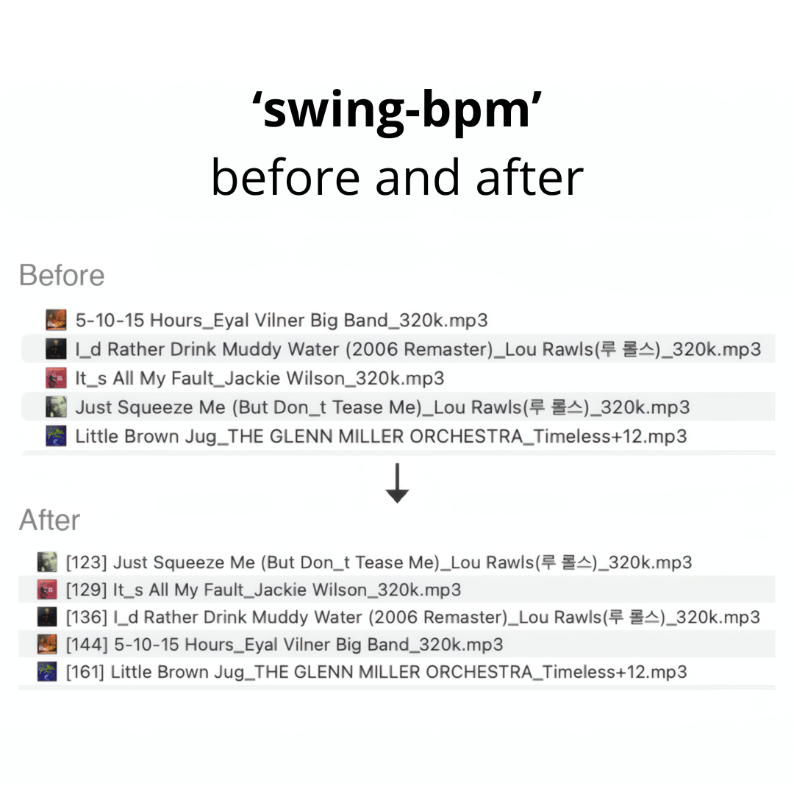

# swing-bpm
{: .fs-9 }

Automatic BPM detection optimized for **swing & jazz music**.
{: .fs-6 .fw-300 }

[](https://buymeacoffee.com/kunokim)
[](https://pypi.org/project/swing-bpm/)
[](https://github.com/Geono/swing-bpm/blob/main/LICENSE)

[Get Started](#install){: .btn .btn-primary .fs-5 .mb-4 .mb-md-0 .mr-2 }
[View on GitHub](https://github.com/Geono/swing-bpm){: .btn .fs-5 .mb-4 .mb-md-0 }
[한국어](/swing-bpm/ko){: .btn .fs-5 .mb-4 .mb-md-0 }

---

Standard BPM detectors often misidentify fast swing tempos (180+ BPM) as half-tempo. `swing-bpm` solves this with a hybrid detection algorithm that combines onset analysis with Predominant Local Pulse (PLP), achieving **100% accuracy** on an 80-song test set spanning 80–304 BPM.



## Install

```bash
pip install swing-bpm
```

To update:

```bash
pip install --upgrade swing-bpm
```

<details>
<summary><strong>Install from source (alternative)</strong></summary>

### macOS

1. Install Python 3.9+ (if not already installed):
   ```bash
   brew install python
   ```

2. Download and install swing-bpm:
   ```bash
   git clone https://github.com/Geono/swing-bpm.git
   cd swing-bpm
   pip3 install .
   ```

### Windows

1. Install Python 3.9+ from [python.org](https://www.python.org/downloads/). **Check "Add Python to PATH"** during installation.

2. Install [Git for Windows](https://git-scm.com/downloads/win) if you don't have it.

3. Open **Command Prompt** or **PowerShell**, then:
   ```
   git clone https://github.com/Geono/swing-bpm.git
   cd swing-bpm
   pip install .
   ```

   If you don't have Git, you can [download the ZIP](https://github.com/Geono/swing-bpm/archive/refs/heads/main.zip) instead, extract it, and run `pip install .` inside the folder.

### Update from source

```bash
cd swing-bpm
git pull
pip3 install .
```

If you installed with `pipx`:

```bash
cd swing-bpm
git pull
pipx install --force .
```

</details>

## Usage

Tag all music files in a folder:

```bash
# macOS
swing-bpm ~/Music/swing/

# Windows
swing-bpm "C:\Users\YourName\Music\swing"
```

This will recursively scan all subdirectories and for each file:
1. Detect BPM for each file
2. Rename files with a `[BPM]` prefix (e.g., `[174] Tea For Two.mp3`)
3. Write BPM to audio metadata (ID3 TBPM for MP3/WAV, Vorbis comment for FLAC)

### Options

```bash
swing-bpm ./music/ --dry-run       # Preview without changes
swing-bpm ./music/ --no-rename     # Metadata only, don't rename
swing-bpm ./music/ --no-metadata   # Rename only, don't write metadata
swing-bpm ./music/ --tag-title     # Prepend [BPM] to title metadata
swing-bpm ./music/ --overwrite     # Re-detect already tagged files
swing-bpm track1.mp3 track2.flac   # Process specific files
```

The `--tag-title` option prepends `[BPM]` to the title metadata tag (e.g., ID3 TIT2). This is useful for DJ software like Mixxx that displays the title from metadata — you can see the BPM directly in the title column. If a file has no title metadata, the filename is used as a fallback.

### Supported formats

- MP3
- FLAC
- WAV

## How it works

### The problem

Most BPM detectors work by finding repeated rhythmic patterns in audio. In swing jazz, beats 1 and 3 of each bar carry heavy accents from the rhythm section, while beats 2 and 4 are lighter. At fast tempos (180+ BPM), detectors often lock onto those strong accents on 1 and 3, which repeat at half the actual tempo — so a 200 BPM song gets detected as 100 BPM.

### The solution: a 4-stage hybrid approach

**Stage 1: Base detection**

We use `librosa.beat.beat_track()` to find an initial tempo estimate. This works well for slow-to-mid tempos but frequently returns half-tempo for fast songs.

**Stage 2: Onset ratio analysis**

**Onset** = a sudden burst of energy in the audio, like a drum hit, a horn accent, or a piano chord attack. We measure onset strength at each detected beat and compare it to the onset strength at the *midpoints* between beats.

If the true tempo is double what was detected, those midpoints are actually real beats — so they'll have strong onsets too. We calculate the ratio: `midpoint onset strength / on-beat onset strength`.

- **Ratio < 0.27** → midpoints are quiet, detected tempo is correct
- **Ratio > 0.33** → midpoints have strong hits, true tempo is 2x
- **Ratio 0.27–0.33** → ambiguous, need a tiebreaker

**Stage 3: PLP tiebreaker**

For borderline cases, we use **PLP (Predominant Local Pulse)** — an algorithm that tracks how the perceived "pulse" of the music evolves over time, frame by frame. Unlike beat tracking which commits to a single global tempo, PLP independently estimates the local pulse at each moment, then we take the median. This gives a second opinion that reliably resolves the ambiguous cases where onset ratio alone can't decide.

**Stage 4: PLP stability guard** *(new in v0.2.0)*

When the base tempo is slow (< 105 BPM), the onset ratio can be misleadingly high — walking bass, piano comping, and vocal phrasing fill the space between beats with continuous energy, even though no real beats exist at the midpoints. To prevent false doubling, we check the **PLP stability** (standard deviation of local pulse estimates). If PLP median is close to the doubled tempo and PLP is moderately stable (std ≤ 55), we trust the doubling. Otherwise, a high PLP std (> 40) means PLP cannot find a consistent fast pulse, confirming the song is genuinely slow — and the doubling is rejected.

## As a library

```python
from swing_bpm import detect_bpm

bpm = detect_bpm("Tea For Two.mp3")
print(bpm)  # 174
```

## Test results

Tested on 80 swing/jazz tracks with human-verified BPM labels (80–304 BPM). All detected values fall within ±10 BPM of the true tempo.

Additionally validated against 417 human-labeled tracks (80–304 BPM): 99.3% within ±10 BPM, with an average absolute error of 3.2 BPM.

<details>
<summary><strong>Full test results (80 songs, 100% accuracy)</strong></summary>

| True BPM | Detected | Diff | Artist | Title |
|----------|----------|------|--------|-------|
| 80 | 81 | +1 | Eyal Vilner | Don't You Feel My Leg |
| 82 | 83 | +1 | Eyal Vilner | Tell Me Pretty Baby |
| 100 | 96 | -4 | Eyal Vilner | After The Lights Go Down Low |
| 107 | 108 | +1 | Helen Humes | Sneaking Around With You |
| 114 | 117 | +3 | Eyal Vilner | Will You Be My Quarantine? |
| 116 | 123 | +7 | Lou Rawls | Just Squeeze Me (But Don't Tease Me) |
| 118 | 117 | -1 | Brooks Prumo Orchestra | Blue Lester |
| 120 | 117 | -3 | Eyal Vilner | Call Me Tomorrow, I Come Next Week |
| 125 | 123 | -2 | Eyal Vilner | Just A Lucky So And So |
| 126 | 129 | +3 | Mint Julep Jazz Band | Exactly Like You |
| 127 | 123 | -4 | Frank Sinatra | You Make Me Feel So Young |
| 128 | 129 | +1 | Eyal Vilner | I Don't Want to be Kissed |
| 128 | 129 | +1 | The Griffin Brothers | Riffin' With Griffin' |
| 128 | 129 | +1 | Shirt Tail Stompers | Oh Me, Oh My, Oh Gosh |
| 130 | 136 | +6 | Lou Rawls | I'd Rather Drink Muddy Water |
| 133 | 123 | -10 | Louis Jordan | No Sale |
| 134 | 136 | +2 | The Treniers | Drink Wine, Spo-Dee-O-Dee |
| 134 | 136 | +2 | Fred Mollin, Blue Sea Band | Shoo Fly Pie And Apple Pan Dowdy |
| 134 | 136 | +2 | Naomi & Her Handsome Devils | Take It Easy Greasy |
| 135 | 136 | +1 | Indigo Swing | The Best You Can |
| 138 | 136 | -2 | Benny Goodman | What Can I Say After I Say I'm Sorry |
| 139 | 136 | -3 | Louis Jordan | Cole Slaw (Sorghum Switch) |
| 140 | 136 | -4 | Count Basie | Things Ain't What They Used To Be |
| 143 | 136 | -7 | George Williams | Celery Stalks At Midnight |
| 153 | 152 | -1 | Roy Eldridge | Jump Through the Window |
| 155 | 161 | +6 | Brooks Prumo Orchestra | Broadway |
| 155 | 161 | +6 | Illinois Jacquet | What's This |
| 156 | 161 | +5 | The Griffin Brothers | Shuffle Bug |
| 160 | 152 | -8 | Count Basie | Swingin' The Blues |
| 161 | 161 | +0 | Mercer Ellington | Steppin' Into Swing Society |
| 162 | 161 | -1 | Eyal Vilner | Blue Skies |
| 166 | 167 | +1 | Ella Fitzgerald | Mack The Knife (Live) |
| 167 | 161 | -6 | Count Basie | Fair And Warmer |
| 170 | 172 | +2 | Count Basie & His Orchestra | Sweets |
| 170 | 178 | +8 | Duke Ellington, Johnny Hodges | Villes Ville Is the Place, Man |
| 171 | 172 | +1 | Johnny Hodges | Something to Pat Your Foot To |
| 173 | 178 | +5 | Duke Ellington | Let's Get Together |
| 174 | 172 | -2 | Eyal Vilner | Bumpy Tour Bus |
| 174 | 172 | -2 | Eyal Vilner | Tea For Two |
| 176 | 178 | +2 | Eyal Vilner | T'aint What You Do |
| 180 | 185 | +5 | Eyal Vilner | I Want Coffee |
| 181 | 191 | +10 | Bud Freeman's Summa Cum Laude Orchestra | You Took Advantage Of Me |
| 182 | 178 | -4 | Eyal Vilner | I Love The Rhythm in a Riff |
| 182 | 178 | -4 | The Glenn Crytzer Orchestra | Jive at Five |
| 182 | 185 | +3 | Harry James And His Orchestra | Trumpet Blues and Cantabile |
| 182 | 191 | +9 | Bud Freeman's Summa Cum Laude Orchestra | You Took Advantage Of Me |
| 190 | 191 | +1 | Illinois Jacquet | Bottom's Up |
| 190 | 199 | +9 | Eyal Vilner | Chabichou |
| 190 | 191 | +1 | Tommy Dorsey | Well Git It |
| 192 | 199 | +7 | The Griffin Brothers | Blues With A Beat |
| 192 | 191 | -1 | Freddie Jackson | Duck Fever |
| 195 | 191 | -4 | Earl "Fatha" Hines | Hollywood Hop |
| 195 | 199 | +4 | The Griffin Brothers | Blues With A Beat |
| 195 | 199 | +4 | Count Basie | It's Sand, Man |
| 195 | 199 | +4 | Chick Webb | Lindyhopper's Delight |
| 196 | 191 | -5 | Naomi & Her Handsome Devils | I Know How To Do It |
| 203 | 199 | -4 | Ella Fitzgerald, Chick Webb | I Want To Be Happy |
| 205 | 199 | -6 | Jack McVea & His Orchestra | Ube Dubie |
| 205 | 199 | -6 | Jonathan Stout & His Campus Five | Wholly Cats |
| 207 | 215 | +8 | Brooks Prumo Orchestra | Dinah |
| 210 | 207 | -3 | — | Diga Diga Doo |
| 210 | 215 | +5 | Artie Shaw | Oh! Lady, Be Good |
| 210 | 207 | -3 | Harry James | Trumpet Blues And Cantabile |
| 212 | 207 | -5 | Count Basie & His Orchestra | Fantail |
| 215 | 215 | +0 | — | Riff Time |
| 216 | 215 | -1 | Benny Goodman | Jam Session 1936 |
| 220 | 225 | +5 | — | Jammin' the Blues |
| 222 | 225 | +3 | — | Clap Hands, Here Comes Charlie |
| 225 | 225 | +0 | — | Harlem Jump |
| 227 | 225 | -2 | — | Sing You Sinners |
| 228 | 235 | +7 | Earl Hines | The Earl |
| 230 | 225 | -5 | Eyal Vilner | Lobby Call Blues |
| 230 | 235 | +5 | Brooks Prumo Orchestra | Six Cats And A Prince |
| 240 | 235 | -5 | Eyal Vilner | Swing Brother Swing |
| 245 | 246 | +1 | Eyal Vilner | Jumpin' At The Woodside |
| 246 | 246 | +0 | Count Basie | Jumping At The Woodside |
| 250 | 258 | +8 | Brooks Prumo Orchestra | Peek-A-Boo |
| 250 | 258 | +8 | Eyal Vilner | Swingin' Uptown |
| 255 | 258 | +3 | King Of Swing Orchestra | Bugle Call Rag |
| 304 | 304 | +0 | Eyal Vilner | Hellzapoppin' |

</details>

## Changelog

### v0.4.0

- **Recursive directory scanning by default** — When a directory is given, all subdirectories are now scanned automatically. No extra flags needed.

### v0.3.0

- **New: `--tag-title` option** — Prepends `[BPM]` to the title metadata tag (ID3 TIT2 for MP3/WAV, Vorbis comment for FLAC). Useful for DJ software that doesn't reliably read BPM metadata. Falls back to filename when the title tag is empty.

### v0.2.1

- **Fix: false half-tempo on mid-tempo songs with slow base detection** — When `beat_track` returned half-tempo (e.g., 74 instead of 148), Stage 4's PLP stability guard (std > 40) could block the correct doubling even when PLP median clearly confirmed the doubled tempo. Now, if PLP median is close to 2x base and PLP is moderately stable (std ≤ 55), doubling is applied before the stability guard.
- **Validated against 549 human-labeled tracks** — 0 regressions vs v0.2.0.

### v0.2.0

- **Fix: false double-tempo on slow ballads** — Added a 4th detection stage that checks PLP stability before doubling.
- **Expanded validation** — Tested against 417 human-labeled tracks. Accuracy: 99.3% within ±10 BPM.
- **Internal: cached PLP computation** — PLP is now computed once and reused across detection stages.

### v0.1.0

- Initial release with 3-stage hybrid detection (beat_track + onset ratio + PLP tiebreaker).
- 100% accuracy on 80-song test set (80–304 BPM, all within ±10 BPM).

---

## Support

If this tool saved you time, consider buying me a coffee!

[](https://buymeacoffee.com/kunokim)

## Acknowledgments

Special thanks to [sabok](https://www.instagram.com/sabok_swing/) for providing sample music used in testing and development.
