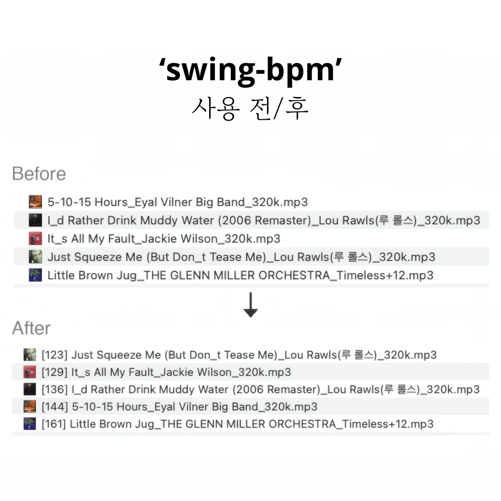

# swing-bpm (한국어)
{: .fs-9 }

스윙 & 재즈 음악에 최적화된 **자동 BPM 측정 도구**입니다.
{: .fs-6 .fw-300 }

[](https://buymeacoffee.com/kunokim)
[](https://pypi.org/project/swing-bpm/)

[시작하기](#설치){: .btn .btn-primary .fs-5 .mb-4 .mb-md-0 .mr-2 }
[GitHub](https://github.com/Geono/swing-bpm){: .btn .fs-5 .mb-4 .mb-md-0 }
[English](/swing-bpm/){: .btn .fs-5 .mb-4 .mb-md-0 }

---

일반적인 BPM 측정기는 빠른 스윙 템포(180+ BPM)를 절반 속도로 잘못 인식하는 경우가 많습니다. `swing-bpm`은 onset 분석과 PLP(Predominant Local Pulse)를 결합한 하이브리드 알고리즘으로 이 문제를 해결하며, 80~304 BPM 범위의 80곡 테스트에서 **100% 정확도**를 달성했습니다.



## 설치

```bash
pip install swing-bpm
```

업데이트:

```bash
pip install --upgrade swing-bpm
```

<details>
<summary><strong>소스에서 설치 (대안)</strong></summary>

### macOS

1. Python 3.9 이상 설치 (이미 있다면 생략):
   ```bash
   brew install python
   ```

2. swing-bpm 다운로드 및 설치:
   ```bash
   git clone https://github.com/Geono/swing-bpm.git
   cd swing-bpm
   pip3 install .
   ```

### Windows

1. [python.org](https://www.python.org/downloads/)에서 Python 3.9 이상을 설치합니다. 설치 시 **"Add Python to PATH"를 반드시 체크**하세요.

2. Git이 없다면 [Git for Windows](https://git-scm.com/downloads/win)를 설치합니다.

3. **명령 프롬프트** 또는 **PowerShell**을 열고 아래를 입력합니다:
   ```
   git clone https://github.com/Geono/swing-bpm.git
   cd swing-bpm
   pip install .
   ```

   Git이 없다면 [ZIP 파일을 다운로드](https://github.com/Geono/swing-bpm/archive/refs/heads/main.zip)한 뒤 압축을 풀고, 해당 폴더에서 `pip install .`을 실행하면 됩니다.

### 소스에서 업데이트

```bash
cd swing-bpm
git pull
pip3 install .
```

`pipx`로 설치한 경우:

```bash
cd swing-bpm
git pull
pipx install --force .
```

</details>

## 사용법

폴더 내 모든 음악 파일에 BPM 태그 달기:

```bash
# macOS
swing-bpm ~/Music/swing/

# Windows
swing-bpm "C:\Users\사용자이름\Music\swing"
```

하위 폴더까지 자동으로 탐색하며, 각 파일에 대해:
1. BPM을 자동 측정합니다
2. 파일명 앞에 `[BPM]`을 붙입니다 (예: `[174] Tea For Two.mp3`)
3. 오디오 메타데이터에 BPM을 기록합니다 (MP3/WAV: ID3 TBPM, FLAC: Vorbis comment)

### 옵션

```bash
swing-bpm ./music/ --dry-run       # 변경 없이 미리보기만
swing-bpm ./music/ --no-rename     # 메타데이터만 기록 (파일명 변경 안 함)
swing-bpm ./music/ --no-metadata   # 파일명만 변경 (메타데이터 기록 안 함)
swing-bpm ./music/ --tag-title     # 제목 메타데이터 앞에 [BPM] 붙이기
swing-bpm ./music/ --overwrite     # 이미 태그된 파일도 다시 측정
swing-bpm track1.mp3 track2.flac   # 특정 파일만 처리
```

`--tag-title` 옵션은 제목 메타데이터(ID3 TIT2 등) 앞에 `[BPM]`을 붙입니다. Mixxx 같은 DJ 소프트웨어에서 메타데이터의 BPM 태그를 제대로 읽지 못할 때 유용합니다 — 제목 컬럼에서 BPM을 바로 확인할 수 있습니다. 제목 메타데이터가 비어있는 파일은 파일명을 대신 사용합니다.

### 지원 포맷

- MP3
- FLAC
- WAV

## 작동 원리

### 문제점

대부분의 BPM 측정기는 오디오에서 반복되는 리듬 패턴을 찾아 템포를 계산합니다. 스윙 재즈에서는 각 마디의 1박과 3박에 리듬 섹션의 강한 액센트가 실리고, 2박과 4박은 상대적으로 가볍습니다. 빠른 템포(180+ BPM)에서는 측정기가 1박과 3박의 강한 액센트에만 고정되어 실제 템포의 절반을 감지하게 됩니다 — 200 BPM 곡이 100 BPM으로 잡히는 식입니다.

### 해결: 4단계 하이브리드 방식

**1단계: 기본 측정**

`librosa.beat.beat_track()`으로 초기 템포를 추정합니다. 느린~중간 템포에서는 잘 작동하지만, 빠른 곡에서는 절반 템포를 반환하는 경우가 빈번합니다.

**2단계: Onset 비율 분석**

**Onset** = 드럼 타격, 호른 액센트, 피아노 코드 어택 등 오디오에서 에너지가 갑자기 터지는 순간입니다. 감지된 각 비트 위치의 onset 강도와, 비트 *사이 중간 지점*의 onset 강도를 비교합니다.

만약 실제 템포가 감지된 것의 2배라면, 그 중간 지점은 사실 진짜 비트이므로 강한 onset이 있을 것입니다. 이 비율을 계산합니다: `중간 지점 onset 강도 / 비트 위 onset 강도`.

- **비율 < 0.27** → 중간 지점이 조용함, 감지된 템포가 맞음
- **비율 > 0.33** → 중간 지점에도 강한 타격, 실제 템포는 2배
- **비율 0.27~0.33** → 애매한 경우, 추가 판정 필요

**3단계: PLP 판정**

경계 구간에서는 **PLP(Predominant Local Pulse, 우세 국소 펄스)** 알고리즘을 사용합니다. 비트 트래킹이 하나의 글로벌 템포에 고정하는 것과 달리, PLP는 매 순간의 체감 "맥박"을 프레임 단위로 독립 추정한 뒤 중앙값을 취합니다.

**4단계: PLP 안정성 검증** *(v0.2.0에서 추가)*

기본 템포가 느린 경우(< 105 BPM), 워킹 베이스, 피아노 컴핑, 보컬 프레이징이 비트 사이를 채우면서 onset 비율이 실제보다 높게 나올 수 있습니다. PLP 안정성(표준편차)을 확인하여 2배 처리 여부를 결정합니다.

## 라이브러리로 사용

```python
from swing_bpm import detect_bpm

bpm = detect_bpm("Tea For Two.mp3")
print(bpm)  # 174
```

## 테스트 결과

사람이 직접 확인한 BPM 라벨이 있는 스윙/재즈 80곡(80~304 BPM)으로 테스트했습니다. 모든 측정값이 실제 템포 대비 ±10 BPM 이내입니다.

추가로 417곡(80~304 BPM)으로 검증한 결과, 99.3%가 ±10 BPM 이내이며 평균 절대 오차는 3.2 BPM입니다.

---

## 후원

이 도구가 도움이 되셨다면 커피 한 잔 사주세요!

[](https://buymeacoffee.com/kunokim)

## 감사

테스트 및 개발에 사용된 샘플 음악을 제공해주신 [sabok](https://www.instagram.com/sabok_swing/) 님께 감사드립니다.
